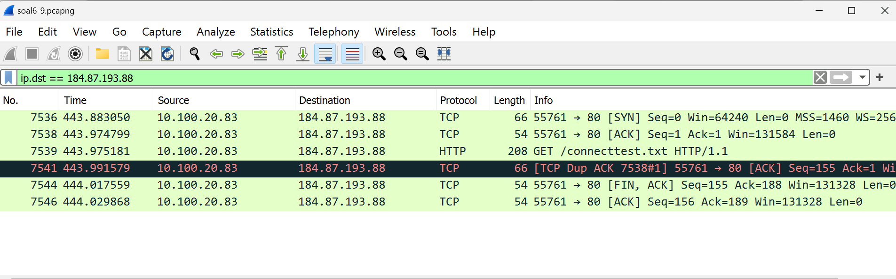

# Jarkom-Modul-1-B05-2023

### Praktikum Jarkom Modul 1
Group Members:
1. Keysa Anadea (5025211028)
2. Hilmy Septian Nursyekha (5025221202)
   
### Question 1 
User melakukan berbagai aktivitas dengan menggunakan protokol FTP. Salah satunya adalah mengunggah suatu file.
a. Berapakah sequence number (raw) pada packet yang menunjukkan aktivitas tersebut? 
b. Berapakah acknowledge number (raw) pada packet yang menunjukkan aktivitas tersebut? 
c. Berapakah sequence number (raw) pada packet yang menunjukkan response dari aktivitas tersebut?
d. Berapakah acknowledge number (raw) pada packet yang menunjukkan response dari aktivitas tersebut?
### Answer 1
#### 1a dan 1b
Untuk mengerjakan soal no 1 a dan b, hal yang pertama dilakukan adalah menggunakan filter FTP. setelah itu dalam soal diberikan instruksi bahwa salah satunya adalah menggunggah suatu file.

setelah itu kita akan mencari info yang requestnya menggunggah file atau STOR. yang terdapat pada no 147 setelah itu kita double tap dua kali serta drop down di transmission control dan protocol dan dapat sequence number raw dan acknowledge number raw.

#### 1c dan 1d
pada c dan d juga memiliki konsep sama hanya saja yang dicari adalah packet yang menunjukan response dari aktivitas tersebut berarti kita ambil packet no setelah 147 yang merupakan response dari aktivitas STOR di n 147.

### Question 2 
Sebutkan web server yang digunakan pada portal praktikum Jaringan Komputer!
### Answer 2
Langkah pertama adalah membuka file capture di Wireshark. Setelah itu, kita menggunakan filter berikut ini di bagian atas layar atau panel "Display Filter" untuk menyaring paket-paket sesuai perintah soal yang ingin dicari: frame contains “Jarkom” setelah itu jika di follow TCP Streamnya akan menunjukkan web server yang digunakan.

### Question 3
Dapin sedang belajar analisis jaringan. Bantulah Dapin untuk mengerjakan soal berikut:
a. Berapa banyak paket yang tercapture dengan IP source maupun destination address adalah 239.255.255.250 dengan port 3702?
b. Protokol layer transport apa yang digunakan?
### Answer 3
#### 3a
Langkah pertama adalah membuka file capture di Wireshark. Setelah itu, kita menggunakan filter berikut ini di bagian atas layar atau panel "Display Filter" untuk menyaring paket-paket sesuai perintah soal yang ingin dicari: (ip.src == 239.255.255.250 && udp.srcport == 3702) || (ip.dst == 239.255.255.250 && udp.dstport == 3702). Filter ini akan menampilkan daftar paket yang memiliki alamat IP sumber atau tujuan 239.255.255.250 dan port 3702.

#### 3b
Pada screenshot diatas juga dapat dilihat bahwa sudah tertera jelas untuk protocol yang digunakan adalah UDP

### Question 4
Berapa nilai checksum yang didapat dari header pada paket nomor 130?
### Answer 4
- membuka file soal di wireshark
- klik kanan pada bagian protocol dari paket no.130
- setelah itu akan terdapat checksum yaitu 0x18e5
- masukkan ncat 10.21.78.111 13591 terminal

### Question 5
Elshe menemukan suatu file packet capture yang menarik. Bantulah Elshe untuk menganalisis file packet capture tersebut.
- Berapa banyak packet yang berhasil di capture dari file pcap tersebut?
- Port berapakah pada server yang digunakan untuk service SMTP?
- Dari semua alamat IP yang tercapture, IP berapakah yang merupakan public IP?
### Answer 5
Pada no 5, kita diminta menganalisis file packet capture berupa zipfile yang memerlukan password untuk membukanya dimana isi dari zipfile tersebut adalah command pada terminal kita bisa memperoleh password dari file soal yang dibuka di wireshark dengan cara membuka salah satu info dengan follow ke TCP Stream, setelah itu kita akan meperoleh password yang perlu decode ke Base64

sehingga diperoleh password untuk membuka zipfile adalah “5implePas5word”, setelah zipfile terbuka, kita bisa memasukkan instance ke terminal

untuk soal a, banyak paket yang tercapture adalah 60

untuk soal b, port yang digunakan untuk service SMTP

untuk soal c, public IP, adalah ip diluar
- 10.0.0.0 — 10.255.255.255
- 172.16.0.0 — 172.31.255.255
- 192.168.0.0 — 192.168.255.255

### Question 6
Seorang anak bernama Udin Berteman dengan SlameT yang merupakan seorang penggemar film detektif. sebagai teman yang baik, Ia selalu mengajak slamet untuk bermain valoranT bersama. suatu malam, terjadi sebuah hal yang tak terdUga. ketika udin mereka membuka game tersebut, laptop udin menunjukkan sebuah field text dan Sebuah kode Invalid bertuliskan "server SOURCE ADDRESS 7812 is invalid". ketika ditelusuri di google, hasil pencarian hanya menampilkan a1 e5 u21. jiwa detektif slamet pun bergejolak. bantulah udin dan slamet untuk menemukan solusi kode error tersebut.

### Question 7
Berapa jumlah packet yang menuju IP 184.87.193.88?
### Answer 7
Untuk mengidentifikasi paket yang mengarah ke alamat IP 184.87.193.88, kita menerapkan suatu filter dengan ekspresi "ip.dst == 184.87.193.88". Filter ini berfungsi untuk menyaring dan menampilkan hanya paket-paket yang memiliki tujuan alamat IP 184.87.193.88. Setelah menerapkan filter ini, kita menghitung jumlah total paket yang terlihat.

### Question 8
Berikan kueri filter sehingga wireshark hanya mengambil semua protokol paket yang menuju port 80! (Jika terdapat lebih dari 1 port, maka urutkan sesuai dengan abjad)
### Answer 8
Filter yang digunakan untuk mengambil semua paket dengan protokol yang ditujukan ke port 80 adalah "tcp.dstport == 80 || udp.dstport == 80". Filter ini memiliki dua bagian: pertama,  akan menangkap paket-paket yang ditujukan ke port 80 menggunakan protokol TCP, dan kedua juga akan menangkap paket-paket yang ditujukan ke port 80 menggunakan protokol UDP. Jadi, dengan filter ini, kita akan mengidentifikasi semua yang terhubung ke port 80, baik melalui TCP maupun UDP.
### Question 9
Berikan kueri filter sehingga wireshark hanya mengambil paket yang berasal dari alamat 10.51.40.1 tetapi tidak menuju ke alamat 10.39.55.34!
### Answer 9
Filter yang digunakan untuk mengambil paket yang memiliki sumber alamat IP 10.51.40.1 tetapi tidak memiliki tujuan alamat IP 10.39.55.34 adalah "ip.src == 10.51.40.1 && ip.dst != 10.39.55.34". Dengan filter ini, kita mengidentifikasi paket-paket yang memenuhi dua kondisi: pertama, paket tersebut harus berasal dari alamat IP 10.51.40.1 (ip.src == 10.51.40.1), dan kedua, paket tersebut tidak boleh ditujukan ke alamat IP 10.39.55.34 (ip.dst != 10.39.55.34).

### Question 10
Sebutkan kredensial yang benar ketika user mencoba login menggunakan Telnet!
### Answer 10
-Langkah pertama yang perlu dilakukan adalah menyaring paket dengan menggunakan query atau filter untuk protokol Telnet. Setelah itu, gulirkan tampilan ke bawah hingga mencapai frame paling bawah karena diasumsikan bahwa pengguna sudah terhubung pada bagian akhir percakapan.
-Setelah sampai pada frame terakhir, selanjutnya tekan opsi yang memungkinkan Anda untuk mengikuti aliran (follow stream) dari protokol TCP yang digunakan dalam koneksi Telnet ini.

-Hasilnya akan dapat melihat bahwa informasi kredensial yang benar untuk masuk adalah sebagai berikut:

Nama Pengguna (Username): dhafin
Kata Sandi (Password): kesayangannyak0k0
