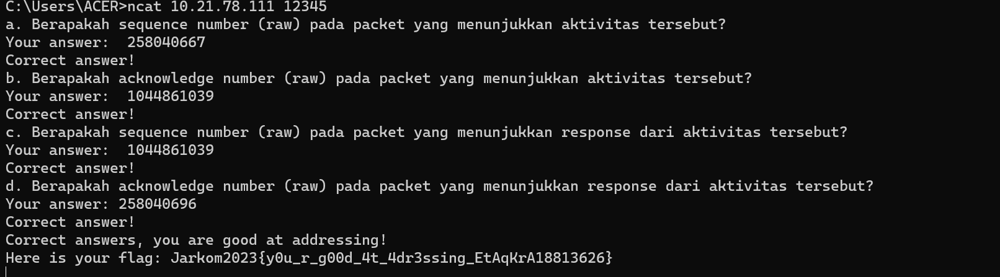
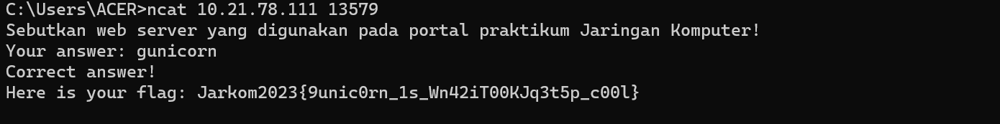
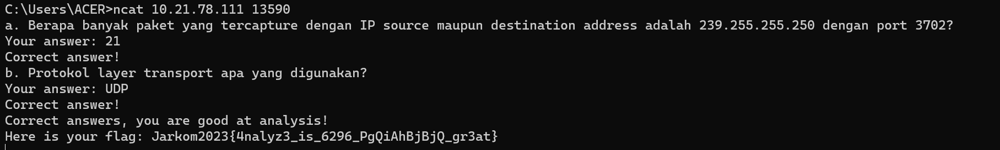
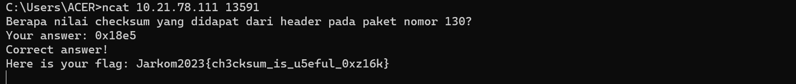
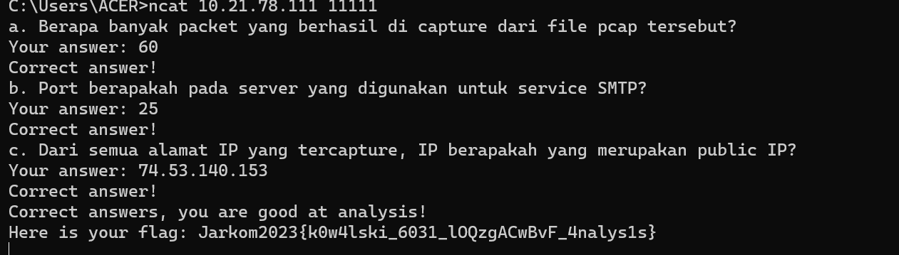
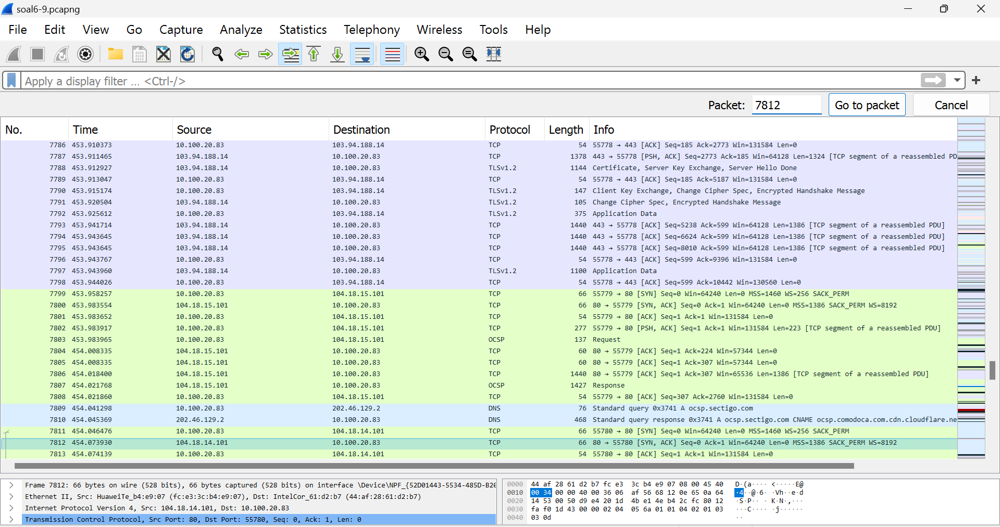
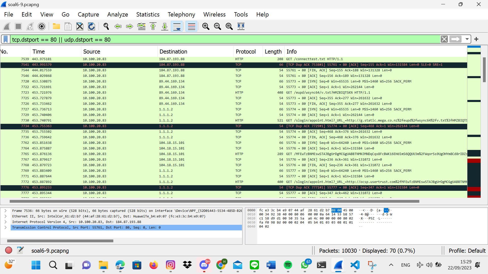
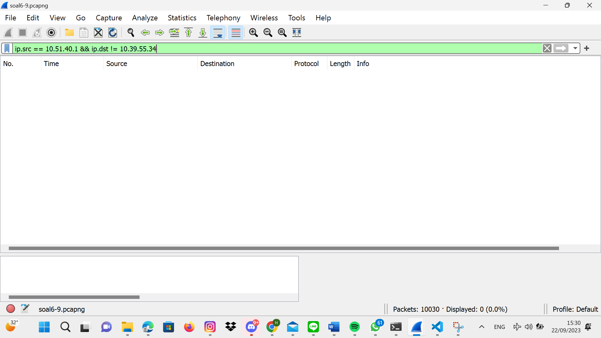
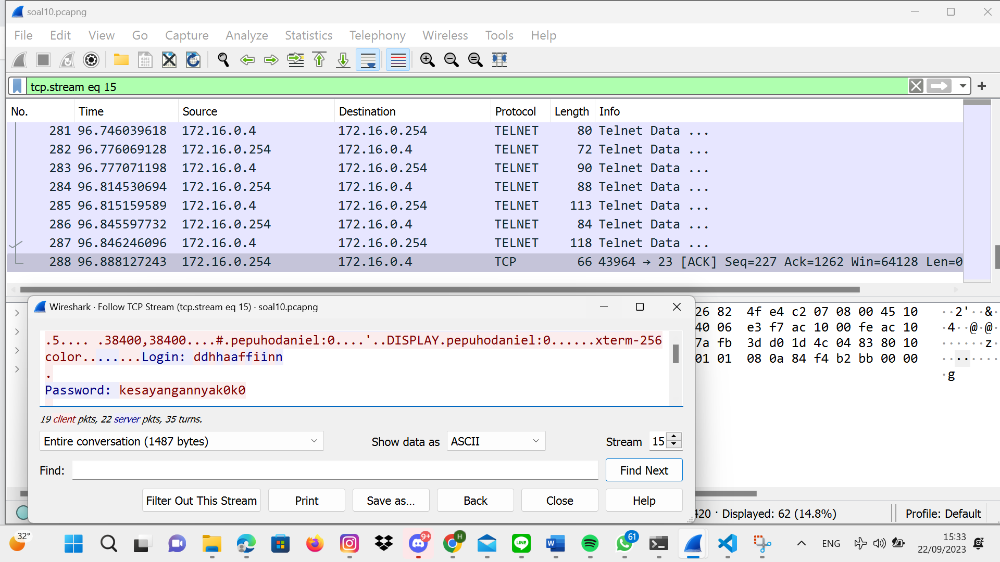

# Jarkom-Modul-1-B05-2023

### Praktikum Jarkom Modul 1
Group Members:
| NRP | Name |
| ------ | ------ |
|5025211028|Keysa Anadea Aqiva Ajie|
|5025221202|Hilmy Septian Nursyekha|
   
### Question 1 

User melakukan berbagai aktivitas dengan menggunakan protokol FTP. Salah satunya adalah mengunggah suatu file.
a. Berapakah sequence number (raw) pada packet yang menunjukkan aktivitas tersebut? 
b. Berapakah acknowledge number (raw) pada packet yang menunjukkan aktivitas tersebut? 
c. Berapakah sequence number (raw) pada packet yang menunjukkan response dari aktivitas tersebut?
d. Berapakah acknowledge number (raw) pada packet yang menunjukkan response dari aktivitas tersebut?

### Answer 1

#### 1a dan 1b

Untuk memulai mengerjakan, langkah pertama adalah menyalin perintah "nc 10.21.78.111 12345" ke terminal, yang akan menghasilkan tampilan pertanyaan atau tugas yang harus dijawab. Selanjutnya, dalam langkah kedua, Amengunduh file bernama "soal1.pcapng" dan membukanya menggunakan Wireshark. Pada langkah ketiga, akan dilakukan pencarian khusus di Wireshark dengan menggunakan perintah "ftp.request.command == "STOR". FTP, atau "File Transfer Protocol," adalah protokol yang digunakan untuk mengirim file antara dua komputer melalui jaringan, seperti internet, dan "STOR" adalah perintah dalam FTP yang digunakan untuk mengirimkan file dari klien ke server. Hasil pencarian ini akan mengidentifikasi permintaan yang dimaksud dalam paket data nomor 147. Dengan demikian, tiga langkah ini membentuk proses yang harus diikuti untuk menyelesaikan tugas atau pertanyaan yang diberikan.

Langkah keempat melibatkan pemilihan pada protokol kontrol transmisi (Transmission Control Protocol), yang selanjutnya akan menampilkan informasi mengenai nomor urutan (sequence number) dalam format "raw" dan nomor pengetahuan (acknowledge number) dalam format "raw" di layar.

Hasil dari langkah-langkah tersebut adalah sebagai berikut:
no. 147

#### 1c dan 1d

pada c dan d juga memiliki konsep sama hanya saja yang dicari adalah packet yang menunjukan response dari aktivitas tersebut berarti yang merupakan response dari aktivitas STOR di 149.

Langkah keempat melibatkan pemilihan pada protokol kontrol transmisi (Transmission Control Protocol), yang selanjutnya akan menampilkan informasi mengenai nomor urutan (sequence number) dalam format "raw" dan nomor pengetahuan (acknowledge number) dalam format "raw" di layar.

Hasil dari langkah-langkah tersebut adalah sebagai berikut:
no. 149

- 1a --> 258040667
- 1b --> 1044861039
- 1c --> 1044861039
- 1d --> 258040696

HASIL:

### Question 2 
Sebutkan web server yang digunakan pada portal praktikum Jaringan Komputer!
### Answer 2

Langkah pertama adalah menyalin perintah "nc 10.21.78.111 13579" ke terminal, yang akan menghasilkan tampilan pertanyaan atau tugas yang harus dijawab. Selanjutnya, dalam langkah kedua, mengunduh file bernama "soal2.pcapng" dan membukanya menggunakan Wireshark. Langkah ketiga melibatkan penggunaan filter untuk protokol HTTP dalam Wireshark, karena portal web yang akan dianalisis berada di alamat http://10.21.78.111:8000/. Dengan demikian, tiga langkah ini membentuk proses yang harus diikuti.

Langkah ketiga melibatkan langkah-langkah berikut:
Setelah membuka file "soal2.pcapng" di Wireshark dan menerapkan filter HTTP seperti yang telah disebutkan sebelumnya, Anda dapat melanjutkan dengan melakukan tindakan berikut:
- Klik kanan pada salah satu paket yang terkait dengan protokol HTTP yang ingin Anda analisis.
- Pilih opsi "Follow" dari menu yang muncul.
- Dalam submenu "Follow," pilih "HTTP Stream."

HASIL:

### Question 3
Dapin sedang belajar analisis jaringan. Bantulah Dapin untuk mengerjakan soal berikut:
a. Berapa banyak paket yang tercapture dengan IP source maupun destination address adalah 239.255.255.250 dengan port 3702?
b. Protokol layer transport apa yang digunakan?
### Answer 3
#### 3a
Langkah pertama adalah menyalin perintah "nc 10.21.78.111 13590" ke terminal, yang akan menyebabkan munculnya pertanyaan atau tugas yang harus dijawab. Langkah kedua melibatkan pengunduhan file bernama "soal3.pcap" dan membuka file tersebut di Wireshark. Kemudian perlu menerapkan filter dengan menggunakan perintah "ip.addr == 239.255.255.250 && udp.port == 3702" untuk menyaring paket-paket yang relevan dengan alamat IP 239.255.255.250 dan port UDP 3702. 

Setelah itu, bisa dilihat di bawah kanan memeriksa jumlah paket yang berhasil ditangkap, yang dalam hal ini adalah sebanyak 21 paket. 

#### 3b
Langkah keempat adalah setelah memverifikasi bahwa terdapat 21 paket yang berhasil ditangkap dapat memasukkan jawaban ke dalam terminal. Jika jawaban tersebut benar, maka akan muncul pertanyaan kedua, yaitu mengenai protokol layer yang digunakan. Jawaban untuk pertanyaan tersebut telah ditemukan dalam tangkapan layar sebelumnya, yakni menggunakan protokol UDP. 

HASIL :

### Question 4
Berapa nilai checksum yang didapat dari header pada paket nomor 130?
### Answer 4
Langkah pertama adalah menyalin perintah "nc 10.21.78.111 13591" ke terminal, yang akan menghasilkan tampilan pertanyaan atau tugas yang harus dijawab. Selanjutnya perlu mengunduh file "soal4.pcapng" dan membukanya di Wireshark. Kemudian, dalam langkah kedua perlu mencari paket dengan nomor 130 dan menemukan nilai checksum pada bagian User Datagram Protocol (UDP). Langkah terakhir adalah memasukkan nilai checksum yang Anda temukan, yaitu 0x18e5, untuk mendapatkan flag dari soal tersebut.

HASIL :

### Question 5
Elshe menemukan suatu file packet capture yang menarik. Bantulah Elshe untuk menganalisis file packet capture tersebut.
- Berapa banyak packet yang berhasil di capture dari file pcap tersebut?
- Port berapakah pada server yang digunakan untuk service SMTP?
- Dari semua alamat IP yang tercapture, IP berapakah yang merupakan public IP?
### Answer 5
Pada no 5, kita diminta menganalisis file packet capture berupa zipfile yang memerlukan password untuk membukanya dimana isi dari zipfile tersebut adalah command pada terminal kita bisa memperoleh password dari file soal yang dibuka di wireshark dengan cara membuka salah satu info dengan follow ke TCP Stream, setelah itu kita akan meperoleh password yang perlu decode ke Base64

sehingga diperoleh password untuk membuka zipfile adalah “5implePas5word”, setelah zipfile terbuka, kita bisa memasukkan instance ke terminal

untuk soal a, banyak paket yang tercapture adalah 60

untuk soal b, port yang digunakan untuk service SMTP

untuk soal c, public IP, adalah ip diluar dibawah ini, sehingga dibawah ini merupakan ip private:
- 10.0.0.0 — 10.255.255.255
- 172.16.0.0 — 172.31.255.255
- 192.168.0.0 — 192.168.255.255

HASIL:

### Question 6

Seorang anak bernama Udin Berteman dengan SlameT yang merupakan seorang penggemar film detektif. sebagai teman yang baik, Ia selalu mengajak slamet untuk bermain valoranT bersama. suatu malam, terjadi sebuah hal yang tak terdUga. ketika udin mereka membuka game tersebut, laptop udin menunjukkan sebuah field text dan Sebuah kode Invalid bertuliskan "server SOURCE ADDRESS 7812 is invalid". ketika ditelusuri di google, hasil pencarian hanya menampilkan a1 e5 u21. jiwa detektif slamet pun bergejolak. bantulah udin dan slamet untuk menemukan solusi kode error tersebut.

### Answer 6

Pertama, kita perhatikan angka yang ada pada kalimat yang diapit tanda petik. Berdasarkan hint, itu adalah paket yang dimaksudkan, yaitu no 7812. Selanjutnya, kita cek di Wireshark menggunakan fitur Go to Packet dengan searching ke no paket tersebut

Dari gambar tersebut, kita bisa mengambil source adress 104.18.14.101 sebagai clue selanjutnya sebagaimana yang disebutkan pada hint. Lalu kita menuju A1Z26 cipher untuk melakukan decode pada source adress tersebut dan diperoleh :

.png)

Dari dcode tersebut diperoleh "1drn1a" dan sudah memnuhi syarat jumlah karakter, namun masih mengandung karakter angka yang mana pada hint disebutkan "Rentang Huruf yang digunakan Huruf A-R, 1-18 dengan Jawaban 6 Huruf". Lalu kita coba pisahkan source kode tersebut yang memiliki tiga elemen menjadi dua elemen dan satu elemen karena alphabet maksimal memiliki dua digit pada urutan dalam angka, sehingga menjadi "10 4 18 10 1". Setelah itu, kita decode kembali dan hasilnya sebagai berikut : 

.png)

Diperoleh kode "jdrnja". Lalu kita masukkan ke terminal, sebagai berikut :

.png)

Ternyata "jdrnja" adalah kode yang dimaksud, namun testcase yang diminta harus dalam bentuk kapital semua, yaitu "JDRNJA".

### Question 7

Berapa jumlah packet yang menuju IP 184.87.193.88?

### Answer 7

Untuk mengidentifikasi paket yang mengarah ke alamat IP 184.87.193.88, kita menerapkan suatu filter dengan ekspresi "ip.dst == 184.87.193.88". Filter ini berfungsi untuk menyaring dan menampilkan hanya paket-paket yang memiliki tujuan alamat IP 184.87.193.88. Setelah menerapkan filter ini, kita menghitung jumlah total paket yang terlihat.

.png)

Ternyata ada 6 paket yang sesuai dengan kriteria ini. Dengan kata lain, kita berhasil mengidentifikasi dan menampilkan 6 paket yang menuju ke alamat IP 184.87.193.88.

### Question 8

Berikan kueri filter sehingga wireshark hanya mengambil semua protokol paket yang menuju port 80! (Jika terdapat lebih dari 1 port, maka urutkan sesuai dengan abjad)

### Answer 8

Filter yang digunakan untuk mengambil semua paket dengan protokol yang ditujukan ke port 80 adalah "tcp.dstport == 80 || udp.dstport == 80". Filter ini memiliki dua bagian: pertama,  akan menangkap paket-paket yang ditujukan ke port 80 menggunakan protokol TCP, dan kedua juga akan menangkap paket-paket yang ditujukan ke port 80 menggunakan protokol UDP. Jadi, dengan filter ini, kita akan mengidentifikasi semua yang terhubung ke port 80, baik melalui TCP maupun UDP.

.png)

### Question 9

Berikan kueri filter sehingga wireshark hanya mengambil paket yang berasal dari alamat 10.51.40.1 tetapi tidak menuju ke alamat 10.39.55.34!

### Answer 9

-Filter yang digunakan untuk mengambil paket yang memiliki sumber alamat IP 10.51.40.1 tetapi tidak memiliki tujuan alamat IP 10.39.55.34 adalah "ip.src == 10.51.40.1 && ip.dst != 10.39.55.34". 

-Dengan filter ini, kita mengidentifikasi paket-paket yang memenuhi dua kondisi: pertama, paket tersebut harus berasal dari alamat IP 10.51.40.1 (ip.src == 10.51.40.1), dan kedua, paket tersebut tidak boleh ditujukan ke alamat IP 10.39.55.34 (ip.dst != 10.39.55.34).

.png)

### Question 10

Sebutkan kredensial yang benar ketika user mencoba login menggunakan Telnet!

### Answer 10

-Langkah pertama yang perlu dilakukan adalah menyaring paket dengan menggunakan query atau filter untuk protokol Telnet. Setelah itu, gulirkan tampilan ke bawah hingga mencapai frame paling bawah karena diasumsikan bahwa pengguna sudah terhubung pada bagian akhir percakapan.

-Setelah sampai pada frame terakhir, selanjutnya tekan opsi yang memungkinkan Anda untuk mengikuti aliran (follow stream) dari protokol TCP yang digunakan dalam koneksi Telnet ini.

-Hasilnya akan dapat melihat bahwa informasi kredensial yang benar untuk masuk adalah sebagai berikut:

Nama Pengguna (Username): dhafin
Kata Sandi (Password): kesayangannyak0k0

.png)

